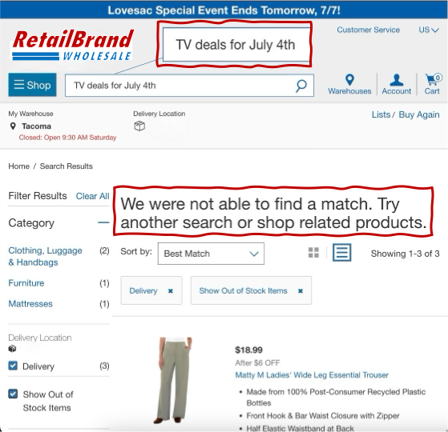
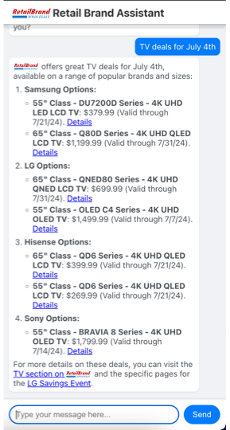
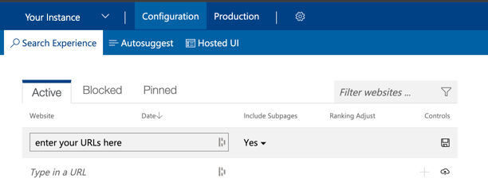
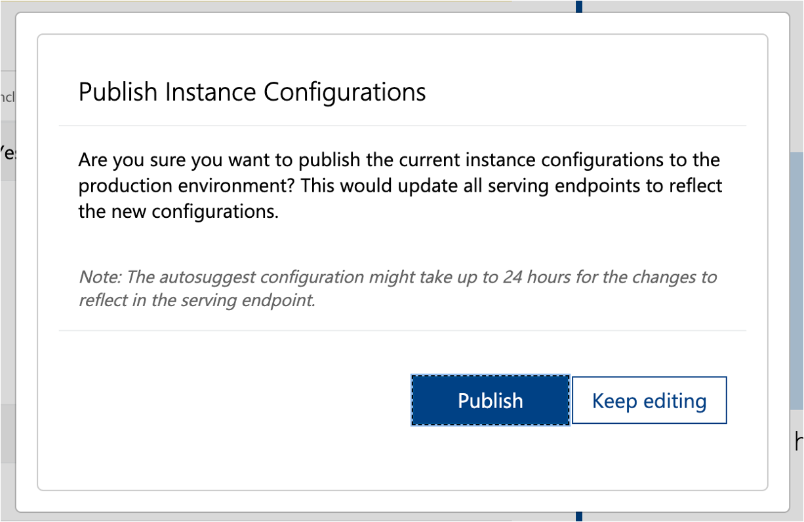

# Retail Brand Assistant

This project is a configurable Retail Brand Assistant built using **Microsoft Semantic Kernel** for AI Orchestration, Open AI gpt-4o Large Language Model, and **Microsoft Bing CustomSearch** for brand-specific search results. Using Retail Brand Assistant allows brands to rapidly test and deploy a fully functioning AI Assistant for Customers that uses real-time page information to answer questions with very high accuracy and consistency.

| When retail brand experiences fail like this... | Retail Brand Assistant succeeds... |
|:----------------------------------------------------------------------------:|:---------------------------------:|
|  |  |

## Prerequisites

- [.NET SDK](https://dotnet.microsoft.com/download) (version 6.0 or later)
- OpenAI API key
- [Bing CustomSearch instance and key](https://www.customsearch.ai/)

## Bing CustomSearch Configuration - Skip if already configured
#### Bing CustomSearch Prerequisites
1. **Microsoft Azure Account**: You need an Azure account to use Bing Custom Search. Sign up at [Azure](https://azure.microsoft.com/).

#### Step 1: Create a Bing Custom Search Resource on Azure

1. Go to the [Azure portal](https://portal.azure.com/).
2. Click on **Create a resource**.
3. Search for **Bing Custom Search** and select it.
4. Click **Create**.
5. Fill in the required details:
   - Subscription: Your Azure subscription.
   - Resource group: Create a new one or use an existing one.
   - Name: A unique name for your resource.
   - Pricing tier: Choose a pricing tier that suits your needs.
   - Resource region: Select the region.
6. Click **Review + create** and then **Create**.

#### Step 2: Access the Bing Custom Search UI

1. After the resource is created, go to the resource page.
2. Under **Resource Management**, click on **Custom Search Portal**. This will take you to the Bing Custom Search UI.

#### Step 3: Add a Domain to Your Custom Search

1. In the Custom Search UI, click on **Create new custom search instance**.
2. Provide a name and description for your custom search instance.
3. Click **Create**.
4. Click on **Add a site to your search instance**.
5. Enter the domain or specific URLs you want to include in your custom search.
6. Click **Add**.

#### Step 4: Customize Your Search Instance

1. After adding the domain, you can further customize your search instance by specifying:
   - **Domains and URLs**: Add multiple domains or specific URLs.
   - **Pinned Results**: Pin specific pages to the top of the search results.
   - **Block Certain Sites**: Exclude certain domains or URLs from search results.
  
      <br>

#### Step 5: Publish Your Custom Search Instance

1. Once you have added the necessary domains and customized your search instance, click on **Publish**.
2. Confirm the details and click **Publish** again to make your custom search instance live.
   
      
      <br>


#### Step 6: Retrieve API Key and Endpoint

1. Go back to the Azure portal, under your Bing Custom Search resource.
2. Under **Keys and Endpoint**, copy one of the keys and the endpoint URL. You will need these if you decide to access the custom search programmatically.

That's it! You've set up and used Bing Custom Search with the Custom Search UI, added domains, and published your custom search instance.

## Retail Brand Assistant Setup
### Project Structure
```
project_root/
├── reactfrontend/
│   ├── public/
│   ├── scripts/
│   ├── src/
│   │   ├── App.css
│   │   ├── App.js
│   ├── package-lock.json
│   └── package.json
├── skbackend/
│   ├── Program.cs
│   ├── RetailContextPlugin.cs
│   ├── SalesHelpPlugin.cs
│   ├── SalesHelpPrompt.txt
│   └── SystemMessage.txt
├── README.md
├── setup.sh
├── start.sh
├── startbackend.sh
├── startfrontend.sh
└── stop.sh
```

1. Clone the repository:
   ```bash
   git clone https://github.com/function1st/retailbrandassistant-public.git
   cd retailbrandassistant-public
   ```

2. Make the scripts executable and run the setup script:
   ```bash
   chmod +x setup.sh start.sh startbackend.sh startfrontend.sh stop.sh
   ./setup.sh
   ```

3. Follow the prompts to enter your brand name, language, market, and locale.

4. Edit the `.env` file and add your API keys:
   ```bash
   OPENAI_API_KEY=your_openai_api_key_here
   RETAIL_CONTEXT_API_KEY=your_retail_context_api_key_here
   CUSTOM_CONFIG_ID=your_bing_custom_config_id_here
   ```

## Usage

1. To start the application:
   ```bash
   ./start.sh
   ```
   This will automatically update the current date in the system message and start both the backend and frontend.

2. Interact with the Retail Brand Assistant through the browser.

3. To stop the application:
   ```bash
   ./stop.sh
   ```

## Configuration

The setup script will help you configure the basic brand information and site information. If you need to change this information later, you can either run the setup script again or manually edit the `SystemMessage.txt` file.

The current date is automatically updated each time you start the application using the start script.

You can customize the Retail Brand Assistant by modifying the following files:

- `SystemMessage.txt`: Contains the system message that defines the agent's behavior and how it uses real-time context.
- `Program.cs`: Main Semantic Kernel logic and chat handling. In addition, the prompt logic for Plug-in orchrestration as well as Topic classification is found here.
- `RetailContextPlugin.cs`: Plugin for retrieving real-time retail context. Leverages Bing CustomSearch to retrieve top results, uses Open AI to pick the most relevant pages that answer the question, visits those pages to parse imporant information from them, and then provides that context back to Semantic Kernel for leveraging with Open AI.
- `SalesHelpPlugin.cs`: Sample plugin for handling sales-related queries based on the SalesHelpPromt.txt instructions.
- `SalesHelpPrompt.txt`: Contains a sample prompt for handling a hypothetical human transfer scenario for sales-related queries.

**IMPORTANT:** This project is intended for educational purposes only and should not be used for production workloads. The creators and contributors of this project accept no responsibility for its functionality, reliability, or any consequences arising from its use.

**Disclaimer**
Users of this project are solely responsible for ensuring their use complies with the terms and conditions of all third-party services utilized, including but not limited to Bing Custom Search, Azure services, and OpenAI. Users must also ensure their use of this project adheres to all applicable local, national, and international laws and regulations.

The creators and contributors of this project are not responsible for any misuse, data breaches, costs incurred, or any other liabilities arising from the use of this project or the third-party services it integrates with. This project is provided "as is" without any warranty, express or implied, including but not limited to the warranties of merchantability, fitness for a particular purpose, and noninfringement. In no event shall the authors or copyright holders be liable for any claim, damages, or other liability, whether in an action of contract, tort, or otherwise, arising from, out of, or in connection with the software or the use or other dealings in the software.

## License
This project is licensed under the Creative Commons Attribution-NonCommercial 4.0 International License. To view a copy of this license, visit [CC BY-NC 4.0](https://creativecommons.org/licenses/by-nc/4.0/).

This project is licensed for free use for educational and non-commercial purposes only. Commercial use is strictly prohibited. The software is provided "as is", without warranty of any kind, express or implied. In no event shall the authors or copyright holders be liable for any claim, damages, or other liability, whether in an action of contract, tort, or otherwise, arising from, out of, or in connection with the software or the use or other dealings in the software.

## Contributing
Contributions to improve the educational value of this project are welcome. Please follow these steps to contribute:

1. Fork the repository
2. Create a new branch for your feature or bug fix
3. Make your changes and commit them with clear, descriptive messages
4. Push your changes to your fork
5. Submit a pull request with a clear description of your changes
